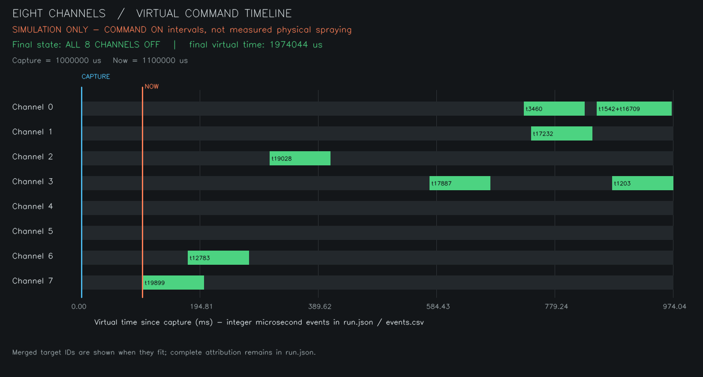
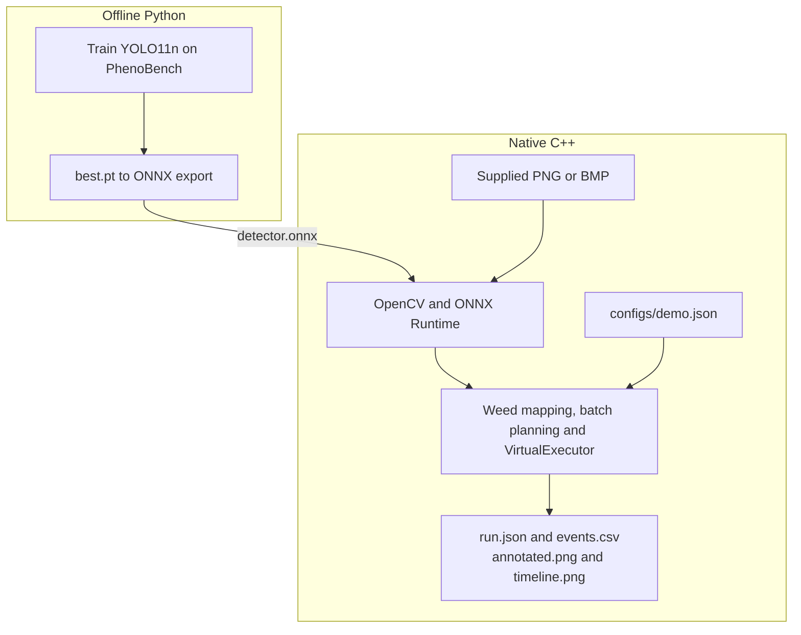

# SmartSpray Vision Controller

**From plant detections to a deterministic eight-channel spray-command schedule.**

A portfolio project that detects crops and weeds, runs the trained model natively in C++ with ONNX Runtime, and converts predicted weed locations into a simulated nozzle-control schedule. Python handles offline training, export and evaluation; the native executable runs without Python, PyTorch or a GPU. Both actuation and image-to-ground geometry are simulated.

## A real saved demonstration

[](docs/assets/timeline.png)

This is the unchanged output of the frozen demo using PhenoBench **training image `05-15_00028_P0030852`**. Its 17 boxes are model predictions: 8 predicted crops are not selected; 9 predicted weeds become accepted targets. There are **0 controller rejections, 8 merged intervals and 16 events**, ending with all eight channels OFF at **1,974,044 us**. Timing and geometry are simulated. This illustrative run is separate from the validation benchmark.

Open the [full-resolution timeline](docs/assets/timeline.png) to read its labels, especially on a narrow screen. The [saved trace](examples/frozen-demo/README.md) exposes every score, box, target, plan and event without installation. The annotated field image remains outside Git pending the specific dataset-image distribution decision described in [asset attribution](docs/assets/ATTRIBUTION.md).

## How the pipeline works



The exported ONNX file crosses the training/runtime boundary. During a native run, one supplied image becomes crop/weed predictions. Only predicted weed box centers become targets in the illustrative two-metre swath. The planner chooses channels and integer-microsecond command times, merges overlapping or touching intervals on each channel, and executes the complete schedule in virtual time.

The four outputs answer different questions:

- **`annotated.png`** shows all predictions, confidence scores, IDs, selected anchors and controller outcomes over the image.
- **`timeline.png`** shows when each of the eight virtual channels is commanded ON and which targets contributed.
- **`run.json`** preserves the complete machine-readable explanation, input hashes, settings, individual plans, merged intervals, events and final states.
- **`events.csv`** is the small chronological ON/OFF log for inspecting exact times and channels.

## Engineering decisions and evidence

The controller is an independent C++17 library with no model or image dependency. It checks geometry, timestamps and arithmetic before producing a schedule. Invalid shared settings fail the batch; invalid individual targets retain explicit rejection reasons. A command due exactly at `now_us` is valid, while a command one microsecond late is rejected. Original target records survive interval merging.

Inference uses a fixed FP32 model contract, explicit letterboxing and deterministic class-aware suppression. The deployment checks compare preprocessing, raw outputs, final detections and controller effects separately. This makes a small numerical difference inspectable before it can become a different channel or timestamp. [Contracts](docs/PROJECT.md) and [inference evidence](docs/INFERENCE.md) retain the detailed boundaries and budgets.

## Measured results

**Detector validation.** Separate experiments on the official 772-image validation split, retaining all 10,408 valid annotated objects, including partial and tiny appearances:

| Model and evaluation runtime | All mAP50–95 | Crop mAP50–95 | Weed mAP50–95 |
|---|---:|---:|---:|
| YOLO11n checkpoint, PyTorch FP32 / GPU / batch 8 | 0.635192 | 0.800301 | 0.470084 |
| Exported ONNX, ORT 1.22.0 FP32 / CPU / batch 1 | 0.635255 | 0.800328 | 0.470182 |

This project protocol is **not the official PhenoBench leaderboard protocol**. Validation selected the checkpoint, and crop identities overlap the supplied splits; these scores do not establish unseen-field generalization. Small/partial weeds, localization errors and crop/weed confusion remain visible limitations. [Training results and failure examples](docs/BASELINE.md) explain the evaluation policy.

**Deployment consistency.** On 32 real and 6 synthetic inputs, the maximum PyTorch-to-ORT final-box difference was 0.000244141 pixels; the maximum score difference was 0.00000274181. Python/C++ ORT outputs were bitwise equal within the tested configuration. All 173 tested real weed targets produced identical controller decisions and schedules. These checks establish numerical consistency on that sample, not additional detector quality.

**CPU runtime.** On a Ryzen 7 7800X3D under Ubuntu/WSL, native Release inference at 1024 × 1024 with ORT 1.22.0 CPU, sequential execution and one intra/inter-op thread took **228.826 ms median / 234.757 ms p95** over 30 runs after 5 warmups. OpenCV also used one thread. This inference stage includes validation/copy checks but excludes preprocessing, postprocessing, model loading and output rendering. It is not total pipeline latency or a real-time guarantee; [stage measurements](docs/INFERENCE.md#validation-regression-and-timing) remain separate.

**Reproduction.** A fresh remote checkout, fresh builds and recreated pinned Python environments passed on the existing Ubuntu/WSL host. This was not a fresh OS or second-machine test. [The verification record](docs/REPRODUCIBILITY.md#verification-result-and-limits) distinguishes CTest registrations, internal scenarios and overlapping Python suites.

## Getting started

### View the saved result

Read the timeline and [saved JSON/CSV example](examples/frozen-demo/README.md) directly on GitHub. No installation, model download or local workflow files are needed.

### Build the controller and run offline tests

From the repository root, with a C++17 toolchain, CMake and Make installed. These commands were verified with GCC 13.3.0 and CMake/CTest 3.28.3 on Ubuntu 24.04 / WSL 2:

```bash
cmake -S . -B build-release -G "Unix Makefiles" -DCMAKE_BUILD_TYPE=Release
cmake --build build-release --parallel 2
ctest --test-dir build-release --output-on-failure --no-tests=error --verbose
./build-release/smartspray_demo
```

This runs the synthetic controller demo and 40 controller scenarios, without ML dependencies. [Additional offline suites](docs/REPRODUCIBILITY.md#existing-python-suites) cover image processing, synthetic models and CLI errors.

### Run the native vision demo

The trained ONNX model and original input images **are not included in a clone**. There is no published project model download. Supply the exact external model identified in [reproduction](docs/REPRODUCIBILITY.md#inputs-and-provenance), an 8-bit three-channel PNG/BMP, the pinned ORT distribution and the declared OpenCV/JSON development libraries. Arbitrary ONNX detectors do not satisfy this model contract.

Enter your absolute paths at the prompts; spaces are supported. Choose an output directory that does not yet exist:

```bash
read -r -p 'ORT release directory: ' ORT_ROOT
read -r -p 'ONNX model file: ' MODEL
read -r -p 'Input image file: ' IMAGE
read -r -p 'New output directory: ' OUTPUT

cmake -S . -B build-vision-release -G "Unix Makefiles" -DCMAKE_BUILD_TYPE=Release \
  -DSMARTSPRAY_BUILD_VISION=ON -DONNXRUNTIME_ROOT="$ORT_ROOT" \
  -DSMARTSPRAY_REAL_MODEL="$MODEL" -DSMARTSPRAY_REAL_IMAGE="$IMAGE"
cmake --build build-vision-release --parallel 2
ctest --test-dir build-vision-release --output-on-failure --no-tests=error --verbose
mkdir -p "$(dirname "$OUTPUT")"
./build-vision-release/smartspray_vision_demo \
  --model "$MODEL" --image "$IMAGE" --config configs/demo.json --output "$OUTPUT"
```

These model/image arguments enable the real-model smoke test. Omitting them yields an explicit skip. The program refuses an existing output directory; repeat into a new one. `run.json` is written last to mark a complete run.

### Reproduce training and export

Follow the existing [data preparation](docs/DATA.md#reproduction), [training/evaluation](docs/BASELINE.md#reproduction) and [ONNX export](docs/INFERENCE.md#verification-and-reproduction) procedures with separately obtained inputs and pinned environments. They are optional for using an already exported model; bit-identical retraining is not promised.

## Documentation map

| Document | What it explains |
|---|---|
| [Project](docs/PROJECT.md) | Scope, coordinates, units, timing, errors and acceptance criteria |
| [Baseline](docs/BASELINE.md) | Training policy, detector validation and observed failures |
| [Inference](docs/INFERENCE.md) | Model contract, preprocessing, decoding, parity and CPU timings |
| [Demo](docs/DEMO.md) | One complete run, output semantics and failure behavior |
| [Reproducibility](docs/REPRODUCIBILITY.md) | Tested dependencies, commands, external hashes and verification |
| [Data](docs/DATA.md) | Annotation conventions, provenance and split limitations |

## Limits and attribution

One image, one virtual pass: no video, tracking, calibrated camera geometry or physical actuation. Predicted box centers are not verified stems; excluding predicted crops does not establish crop protection, chemical savings or hardware safety. This is an independent portfolio project; no employer commission, approval, deployment or evaluation is claimed.

PhenoBench authors and the website/archive license discrepancy are recorded in [attribution](docs/assets/ATTRIBUTION.md). The source-code license remains unset. Ultralytics model/code terms and runtime/dependency notices are separate, as detailed in [third-party notices](docs/BASELINE.md#third-party-notices). No common license is asserted for source code, weights and dataset imagery.
